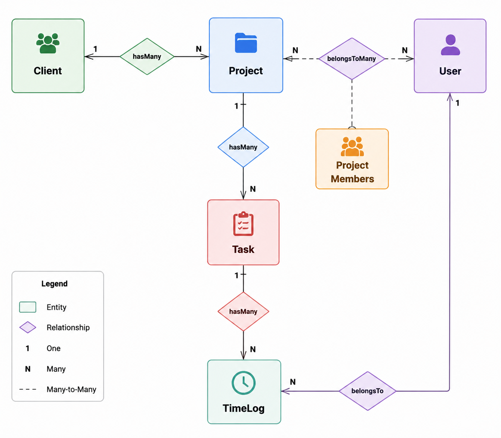
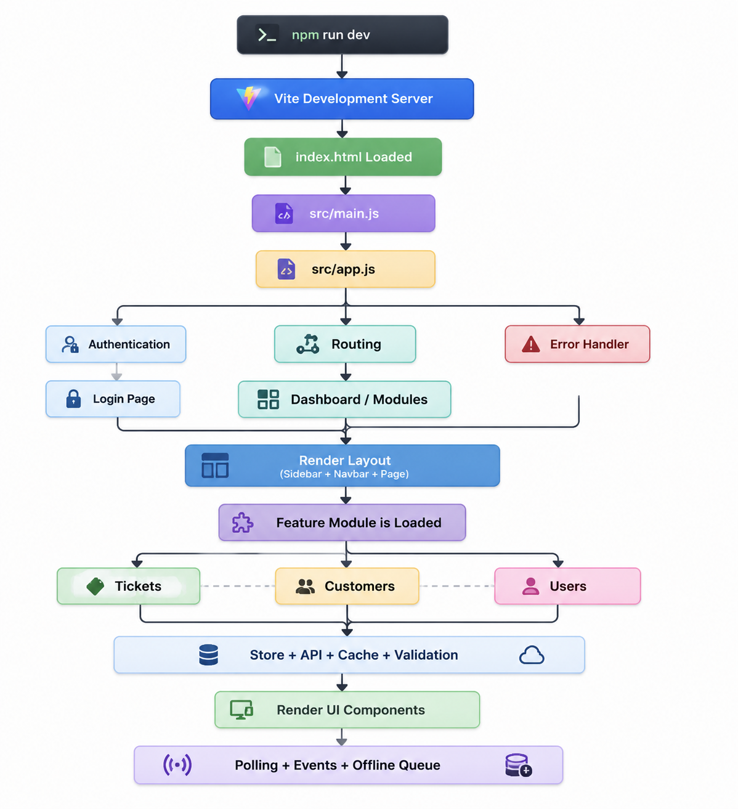

# TaskForge Development Plan

# Project Overview

TaskForge is a Laravel 12 based Project Management System designed to help organizations manage clients, projects, team members, tasks, time tracking, notifications, and role-based access control.

The development approach focused on building a scalable, maintainable, and production-ready application following Laravel best practices.

---

# Development Approach

## Phase 1: Requirement Analysis

### Objectives

- Understand project management workflow requirements
- Identify user roles and permissions
- Define system modules
- Design database structure

### Identified Roles

### Admin

Responsibilities:

- Manage users
- Manage roles
- Access complete system information

### Manager

Responsibilities:

- Manage clients
- Create projects
- Assign team members
- Monitor workflow

### Member

Responsibilities:

- View assigned projects
- Manage tasks
- Add time logs

---

# Phase 2: Database Design

## Database Planning

The database was designed using relational database principles.

Main entities:

- Users
- Clients
- Projects
- Tasks
- Time Logs
- Notifications

## Relationship Design

### User Relationships

- User has many Time Logs
- User belongs to many Projects

### Client Relationships

- Client has many Projects

### Project Relationships

- Project belongs to Client
- Project has many Tasks
- Project belongs to many Users

### Task Relationships

- Task belongs to Project
- Task has many Time Logs

### TimeLog Relationships

- TimeLog belongs to Task
- TimeLog belongs to User

Database relationships were implemented using Laravel Eloquent ORM.

---

# Phase 3: Laravel Application Setup

## Environment Setup

Tasks completed:

- Installed Laravel 12
- Configured environment variables
- Connected MySQL database
- Installed required dependencies

Technology setup:

- PHP 8.3+
- Laravel 12
- MySQL 8
- Blade Templates
- Bootstrap/CSS
- Pest Testing

---

# Phase 4: Authentication Module

Implemented:

- User registration
- Login system
- Logout functionality
- Password reset
- Profile management

Security implementation:

- Password hashing
- Authentication middleware
- Session management

---

# Phase 5: Role Based Access Control

Implemented middleware based authorization.

## Access Rules

### Admin

Allowed:

- User management
- Team management
- Full system access

### Manager

Allowed:

- Client management
- Project management
- Team assignment

### Member

Allowed:

- View assigned projects
- Manage tasks
- Add time logs

---

# Phase 6: Core Module Development

## Client Management

Features:

- Create clients
- Update clients
- View client details
- Delete clients
- Dependency protection

Development tasks:

- Client model
- Client migration
- Client controller
- Client validation
- Client tests

---

## Project Management

Features:

- Create projects
- Assign users
- Update projects
- Archive projects
- Project filtering

Development tasks:

- Project model
- Project migration
- Project-user pivot table
- Project controller
- Authorization rules

---

## Task Management

Features:

- Create tasks
- Assign tasks
- Update task status
- Track deadlines

Development tasks:

- Task migration
- Task model
- Task controller
- Task validation
- Task testing

---

## Time Tracking Module

Features:

- Add time logs
- Update time logs
- Delete time logs
- Validate logged minutes

Development tasks:

- TimeLog model
- TimeLog migration
- TimeLog controller
- Request validation
- Time tracking tests

---

# Phase 7: Notification System

Implemented:

- Database notifications
- Project assignment notifications
- Task alerts
- Email notifications

Workflow:

Client / Manager Action

↓

System Event Trigger

↓

Notification Created

↓

User Receives Alert

---

# Phase 8: Testing Strategy

Testing framework:

- Pest PHP
- Laravel Testing Tools

Implemented tests:

## Authentication Tests

- Guest access restriction
- User dashboard access

## Authorization Tests

- Admin permissions
- Manager permissions
- Member restrictions

## Client Tests

- Client creation
- Client access
- Client deletion protection

## Project Tests

- Project creation
- Project archive validation

## Task Tests

- Task validation

## TimeLog Tests

- Minutes validation
- Time entry rules

Testing result:

---

# Phase 9: Database Seeding

Created realistic demo data:

## Users

Generated:

- Admin users
- Managers
- Members

## Clients

Generated:

- 5 demo clients

## Projects

Generated:

- 10 demo projects

## Tasks

Generated:

- 30 demo tasks

## Time Logs

Generated:

- 100 realistic time records

---

# Phase 10: Documentation

Documentation completed:

## README.md

Includes:

- Project overview
- Installation steps
- Environment setup
- Database setup
- Seeder instructions
- Screenshots
- Architecture explanation

## PLAN.md

Includes:

- Development strategy
- Task breakdown
- Implementation phases
- Testing approach

---

# Project Development Timeline

| Phase | Task | Status |
|---|---|---|
| 1 | Requirement Analysis | Completed |
| 2 | Database Design | Completed |
| 3 | Laravel Setup | Completed |
| 4 | Authentication | Completed |
| 5 | Role Management | Completed |
| 6 | Client Module | Completed |
| 7 | Project Module | Completed |
| 8 | Task Module | Completed |
| 9 | Time Tracking | Completed |
| 10 | Notifications | Completed |
| 11 | Testing | Completed |
| 12 | Documentation | Completed |

---

# Final Architecture

TaskForge was developed using a modular Laravel architecture that ensures:

- Maintainability
- Scalability
- Secure authorization
- Clean database relationships
- Easy future enhancements

The final system provides a complete project management workflow from client creation to project execution, task management, and employee time tracking.
