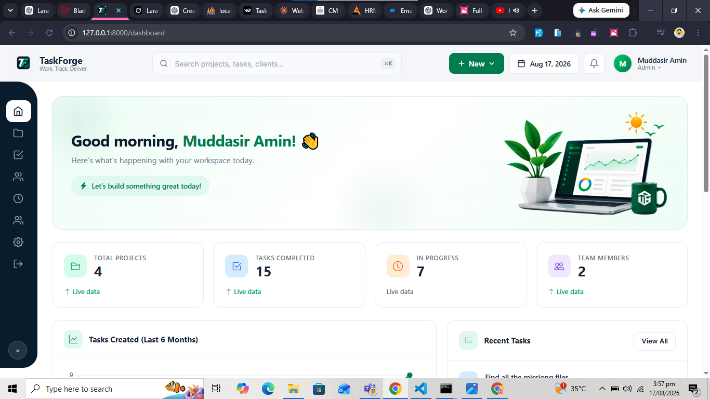
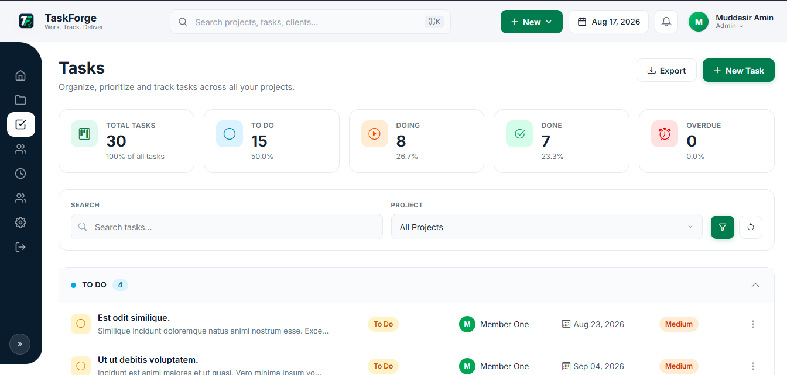

# TaskForge - Laravel 12 Project Management System



TaskForge is a production-ready internal project management application built with Laravel 12.

It helps organizations manage:

- Clients
- Projects
- Team Members
- Tasks
- Time Logs
- Notifications
- Email Alerts
- Role Based Access Control

Developed as part of the Laravel 12 Engineering Internship Assignment.
## Project Repository

The complete source code of TaskForge is available on GitHub:

🔗 https://github.com/MuddasirCreators/Task-Forge
---

# Features

## Authentication


- User registration 
- Login / Logout
- Password confirmation
- Password reset
- Profile management


---

# User Roles

TaskForge supports three roles:

## Admin

- Manage users
- Manage roles
- View complete system data


## Manager

- Create clients
- Create projects
- Assign members
- Manage project workflow


## Member

- View assigned projects
- Create tasks
- Add time logs


---

# Core Modules


## Client Management


Features:

- Create client
- Update client
- View client details
- Delete client protection

A client cannot be deleted if active projects exist.


---

## Project Management


Features:

- Create projects
- Assign team members
- Update project status
- Archive projects
- Filter projects


Archive rules:

- Archived projects become read-only
- Projects with unfinished tasks cannot be archived


---

## Task Management


Features:

- Create tasks under projects
- Update task status
- Track deadlines
- View total logged minutes


---

## Time Tracking



Features:

- Add time logs
- Edit logs
- Delete logs
- Minutes validation

Rules:

- Minimum: 1 minute
- Maximum: 600 minutes per entry


---

# Technology Stack

| Technology | Version |
|-|-|
| Laravel | 12.x |
| PHP | 8.3+ |
| MySQL | 8.x |
| Blade | Laravel Blade |
| Bootstrap/CSS | UI |
| Pest/PHPUnit | Testing |


---

# Requirements

Before installation install:

- PHP >= 8.2
- Composer
- MySQL
- Node.js
- NPM


Check versions:

```bash
php -v

composer -V

node -v

npm -v
```

---

# Installation


## 1. Clone Repository

```bash
git clone repository-url

cd TaskForge
```


## 2. Install PHP Dependencies

```bash
composer install
```


## 3. Environment Setup

Copy environment file:

```bash
cp .env.example .env
```


Generate application key:

```bash
php artisan key:generate
```


---

# Database Configuration

Update `.env`:


```
DB_CONNECTION=mysql
DB_HOST=127.0.0.1
DB_PORT=3306
DB_DATABASE=taskforge
DB_USERNAME=root
DB_PASSWORD=
```


Create database:

```
taskforge
```


---

# Run Migration and Seed Database


Fresh database with demo data:


```bash
php artisan migrate:fresh --seed
```


Seeded data:

- 6 Users
- 5 Clients
- 10 Projects
- 30 Tasks
- 100 Time Logs


Demo roles:

```
Admin
Manager
Member
```


---

# Run Application


Start Laravel server:


```bash
php artisan serve
```


Application:

```
http://127.0.0.1:8000
```


---

# Frontend Assets


Install packages:


```bash
npm install
```


Run Vite:


```bash
npm run dev
```


---

# Queue Setup


TaskForge uses Laravel queues for background notifications.


Run:


```bash
php artisan queue:work
```


Queue handles:

- Overdue task notifications
- Email notifications


---

# Testing


Run complete test suite:


```bash
php artisan test
```


Implemented tests cover:

- Authentication
- Authorization
- Client permissions
- Project rules
- Task validation
- Time log validation
- Delete protection
- Business rule failures


Current test coverage:

```
16+ Feature Tests
```

---

# Requirement Mapping


| Requirement | Implementation |
|-|-|
| Authentication | Laravel Breeze |
| Roles | Middleware + Authorization |
| Clients CRUD | ClientController |
| Projects CRUD | ProjectController |
| Tasks CRUD | TaskController |
| Time Logs | TimeLogController |
| Validation | Form Requests |
| Notifications | Laravel Notifications |
| Testing | Pest Feature Tests |
| Database | MySQL migrations + seeders |


---

# Engineering Practices


## Form Requests

All validation is handled using:

```
app/Http/Requests
```


No validation logic exists inside controllers.


---

## Authorization

Access control implemented using:

- Middleware
- Policies


Protected actions:

- Client management
- Project management
- Task access
- Time logging


---

## Eloquent Optimization

To avoid N+1 queries:

Example eager loading:

```php
Project::with([
    'client',
    'tasks',
    'members'
])->get();
```


---

# Database Relationships


## User

- Has many TimeLogs
- Belongs to many Projects


## Client

- Has many Projects


## Project

- Belongs to Client
- Has many Tasks
- Belongs to many Users


## Task

- Belongs to Project
- Has many TimeLogs


## TimeLog

- Belongs to Task
- Belongs to User


---

# Screenshots


## Dashboard


## Login


## Clients


## Projects


## Tasks


## Time Logs


---

# Project Structure


```
app
 ├── Actions
 ├── Http
 │    ├── Controllers
 │    ├── Requests
 │    └── Policies
 ├── Models
 ├── Notifications


database
 ├── migrations
 ├── factories
 └── seeders


tests
 └── Feature
```


---

# Assignment Compliance


Implemented according to Laravel 12 Internship requirements:

✔ MVC Architecture  
✔ Form Requests  
✔ Policies  
✔ Eloquent Relationships  
✔ Seed Data  
✔ Notifications  
✔ Queue Processing  
✔ Automated Tests  
✔ Role Based Access Control  


---

# Author

Your Name

Laravel 12 Full Stack Developer